<!-- SPDX-License-Identifier: MIT -->
<p align="center">
  
</p>

# Hob

<p align="center">
  <a href="https://github.com/adamskijow/Hob/actions/workflows/ci.yml"></a>
  <a href="https://github.com/adamskijow/Hob/releases/latest"></a>
  
  
  
  
</p>

**Text Hob what is on your mind; get a realistic day and renegotiate it in chat.**

Hob is a personal task agent that understands plain language, powered by a
local LLM (Ollama) and run as a long-lived daemon on macOS. It is named for the
ledge at the side of a hearth where a kettle is kept warm and ready.

## Why

Some tasks are too small for a calendar and too fleeting to survive until you
open a to-do app. With Hob you just text them ("call the pool guy", "dentist
next friday at 2pm") and each morning one digest lays out your day. Corrections
are the point: "already did the prez one", "push the audit to wednesday",
"that's urgent", "scratch that" all work, because every message flows through
one natural-language interpreter. When a message is ambiguous, Hob asks instead
of guessing, and every change is undoable. The model and your data stay on your
machine; only the Telegram transport leaves it.

Unlike a command parser, Hob can also answer "what should I do next?" or "I
have 40 minutes and low energy" with a short plan grounded in the actual task
list. Semantic recall finds related work across labels, notes, projects, and
forwarded context even when the words do not match exactly. These read-only LLM
passes validate every returned item id before showing it; mutations still go
through the deterministic core.

## Getting started

One command installs [uv](https://docs.astral.sh/uv/) and
[Ollama](https://ollama.com/) if missing, syncs deps, pulls the model, and runs
the preflight:

```
scripts/setup.sh                  # honors HOB_MODEL; safe to re-run
```

Or do it by hand (needs uv and a local Ollama with a JSON-capable instruct model):

```
ollama pull qwen2.5:7b-instruct   # or 14b-instruct if you have headroom
uv sync                           # venv, Python 3.12, deps
uv run python app.py doctor       # preflight: token, ollama, model, config, db
uv run python app.py              # start hob
```

Create the bot: message [@BotFather](https://t.me/BotFather), send `/newbot`,
put the token in `HOB_TELEGRAM_TOKEN`, and message the bot privately with
`/start`. The first `/start` pairs Hob to that Telegram user; every other user
and all group chats are rejected. For explicit deployment-time ownership, set
`HOB_ALLOWED_TELEGRAM_USER_ID` before starting.

## Usage

Talk to it like a person:

- "call the vet at 3pm" gets a reminder ping before the time; reply "done" or
  "snooze 20" to the ping, or just react with a thumbs-up to complete it.
- "take out the trash every monday" recurs; multiple weekdays, monthly/yearly,
  and intervals such as "every 2 weeks" work too. "In a couple days", "end of
  the month", and "this weekend" all resolve to real dates.
- "did everything today but the slides", "push everything to tomorrow", "what's
  overdue", "what did i finish this week", "what am i waiting on".
- "for the wedding: book the caterer, order flowers" files a tagged project;
  "add a note to the vet one: gate code is 4412" sticks a note.
- Forward someone's message to capture it, edit a message to correct it, or use
  `/today`, `/list`, `/settings`, `/undo`, `/help`.
- Ask "plan my day", "what should I do next?", or "I have 30 minutes before I
  leave" for a short plan. Hob proposes; it does not move anything until asked.

The full tour lives in [everything Hob understands](docs/features.md).

## Configure

All configuration is environment variables:

| Variable | Meaning | Default |
| --- | --- | --- |
| `HOB_TELEGRAM_TOKEN` | Bot token from BotFather | (none; bot disabled) |
| `HOB_ALLOWED_TELEGRAM_USER_ID` | Optional explicit owner id; otherwise first private `/start` pairs | (pair on first start) |
| `HOB_MODEL` | Ollama model name | `qwen2.5:7b-instruct` |
| `HOB_WAKE_TIME` | Morning digest time, `HH:MM` 24h | `07:00` |
| `HOB_TIMEZONE` | IANA timezone, e.g. `America/New_York` | `UTC` |
| `HOB_DB_PATH` | SQLite file path | `hob.db` |
| `HOB_OLLAMA_HOST` | Ollama endpoint | `http://localhost:11434` |
| `HOB_KEEP_ALIVE` | How long Ollama keeps the model loaded | `-1` (resident) |
| `HOB_REMINDER_LEAD` | Minutes of heads-up before a timed task | `10` |
| `HOB_EOD_TIME` | Evening recap time (empty disables) | `20:30` |

The digest and recap times can also be changed in chat ("send the morning
digest at 8"), no restart needed.

Back up or export everything:

```
uv run python app.py backup /safe/place/hob-backup.db
uv run python app.py export /safe/place/hob-export.json
```

## Docs

- [Everything Hob understands](docs/features.md): the full feature tour.
- [Architecture](docs/architecture.md): pure core, adapters at the edges, and
  the two correctness rules (the model never does date math; fuzzy language
  never silently mutates state).
- [Deployment](docs/deployment.md): run it durably under `launchd`, with
  [Hearth](https://github.com/adamskijow/Hearth) keeping Ollama alive.
- [Development](docs/development.md): the test suite and the real-model eval.

## License

MIT. Every source file starts with `# SPDX-License-Identifier: MIT`.
