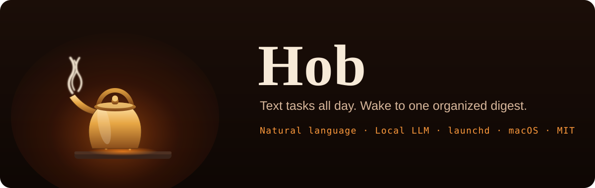

<!-- SPDX-License-Identifier: MIT -->
<p align="center">
  
</p>

# Hob

<p align="center">
  <a href="https://github.com/adamskijow/Hob/actions/workflows/ci.yml"></a>
  
  
</p>

Hob is a local-first planner for iPhone and Mac. Describe work naturally.
Appointments keep their stated times; untimed work stays on deck until you ask
Hob to schedule it. Apple's Foundation Models framework interprets messages on
the device, and tasks sync through your private iCloud account.

## Current build

Signed development builds run on the paired iPhone and Mac. TestFlight and App
Store distribution remain 1.0 release gates. The retired Telegram and Ollama
edition stays in the repository for migration and regression coverage.

## What it does

- Captures tasks, dates, deadlines, priority, and effort from one message.
- Understands relative and named dates, with confirmation for dates over two years away.
- Repeats daily, weekly, monthly, or yearly work without duplicating tasks.
- Answers capacity, placement, and what-if questions without changing the plan.
- Optionally plans around selected Apple calendars, including shared and subscribed calendars.
- Keeps today current and offers timed morning and evening check-ins.
- Rolls untimed work forward while leaving missed appointments for rescheduling.
- Builds a timed proposal only when asked, then adopts it locally.
- Sends optional start reminders with Done, Snooze, and Replan actions.
- Syncs tasks privately between iPhone and Mac through iCloud.
- Preserves schedules, undo, and recovery state across restarts.
- Keeps message interpretation and Calendar details on the device.

## Requirements

- iOS 26 or macOS 26
- Apple Intelligence enabled and available
- iCloud for cross-device task sync

## Build and test

```sh
DEVELOPER_DIR=/Applications/Xcode.app/Contents/Developer swift test --package-path native/HobAppFoundation
uv sync --locked
uv run pytest
```

iPhone simulator build:

```sh
DEVELOPER_DIR=/Applications/Xcode.app/Contents/Developer xcodebuild \
  -project native/HobAppleApps/HobAppleApps.xcodeproj \
  -scheme HobiOS -sdk iphonesimulator \
  -destination 'generic/platform=iOS Simulator' \
  CODE_SIGNING_ALLOWED=NO build
```

Mac build:

```sh
DEVELOPER_DIR=/Applications/Xcode.app/Contents/Developer xcodebuild \
  -project native/HobMacApp/HobMacApp.xcodeproj \
  -scheme Hob CODE_SIGNING_ALLOWED=NO build
```

Signed device installs require the local development profiles. See
[Development](docs/development.md).

## Docs

- [Handoff](HANDOFF.md)
- [Features](docs/features.md)
- [Architecture](docs/architecture.md)
- [Apple app](docs/app-store.md)
- [Development](docs/development.md)
- [Deployment](docs/deployment.md)
- [1.0 acceptance](docs/audits/v1.0-acceptance.md)

## License

MIT.
